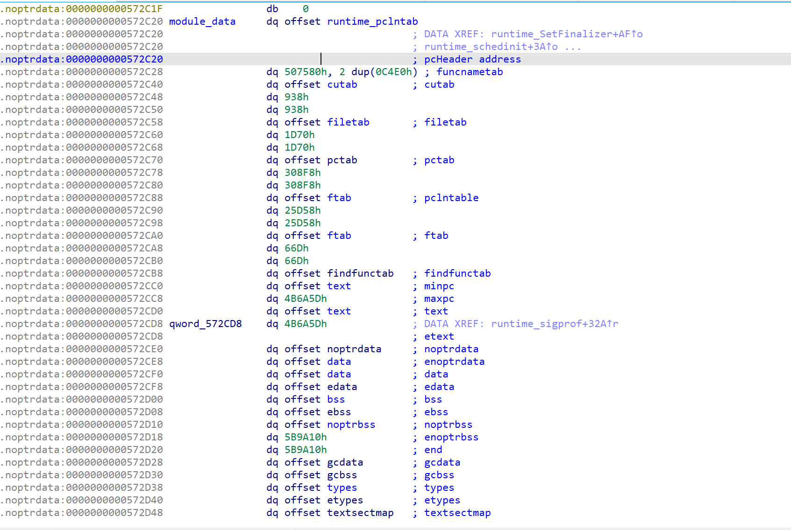
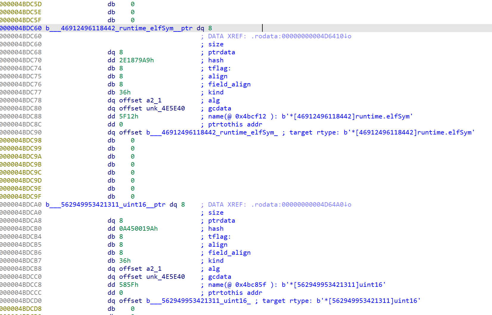

# Gomate
Gomate is an advanced anlysis and eraser plugin of IDA 7.5+ for Go 1.16 executables.
Gomate 是一个为 Go 1.16 量身定制的分析关键和擦除关键信息的 IDA 7.5+ 插件.

Gomate works with IDApython 3.9.
Gomate 使用 IDApython 3.9.

## Installation / 安装

Just download all files to Your Computer.
将仓库所有文件下载到你的电脑上.

## Usage / 使用
Use IDA to analyse aim Go executables. When IDA is idle, just click  the "script file" menu. And select the go_eraser.py.
先使用 IDA 分析目标 Go 程序。当 IDA 分析完毕， 使用 IDA 菜单中的脚本文件功能，选择 go_parser.py.

If you want to erase all trival data structure for runtime, You can select the go_eraser.py
如果你想把所有对运行无影响的数据结构擦除，你需要选择 go_eraser.py

## Info / 提示
have fun！

parse 效果

